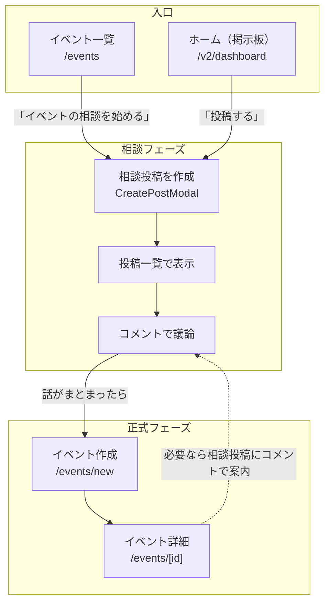

# 案A: 掲示板でイベント相談 → イベント作成 の全体フロー

## 概要

**案A**では、学校掲示板（ホーム）の投稿・コメント機能をそのまま使い、イベント企画の相談を行い、話がまとまったら誰かが正式にイベントを作成する流れを想定しています。

---

## 現状の構成（把握済み）

| 画面 | パス | 役割 |
|------|------|------|
| **ホーム（学校掲示板）** | `/v2/dashboard` | 学校ごとの投稿一覧。全体/同級生/部活OBタブ。投稿・コメント・いいね |
| **イベント一覧** | `/events` | 開催予定イベント一覧。「イベントを作成」ボタンあり |
| **イベント作成** | `/events/new` | 正式なイベントを新規作成 |
| **イベント詳細** | `/events/[id]` | イベント詳細・参加表明 |

**データ:**
- `posts` … 掲示板投稿（school_id, board_type, content, コメント・いいね）
- `events` … イベント（school_id, organizer_id, title, event_date, location など）

---

## 案Aの全体フロー（ユーザー視点）

```
┌─────────────────────────────────────────────────────────────────────────────┐
│  Step 1: 相談を始める                                                        │
├─────────────────────────────────────────────────────────────────────────────┤
│  ・イベント一覧(/events) または ホーム(/v2/dashboard) から                    │
│  ・「イベントの相談を始める」をクリック                                        │
│  ・→ ホームへ遷移し、投稿モーダルを開く（学校・掲示板種別を選択済み）          │
│  ・「〇〇の同窓会やりたい！日程・場所どうする？」など相談内容を投稿             │
└─────────────────────────────────────────────────────────────────────────────┘
                                    │
                                    ▼
┌─────────────────────────────────────────────────────────────────────────────┐
│  Step 2: コメントで議論                                                      │
├─────────────────────────────────────────────────────────────────────────────┤
│  ・同じ学校の人がホームの投稿を見てコメント                                    │
│  ・「3月の第2土曜はどう？」「〇〇カフェで集まろう」など                        │
│  ・いいねで賛同を示す                                                        │
└─────────────────────────────────────────────────────────────────────────────┘
                                    │
                                    ▼
┌─────────────────────────────────────────────────────────────────────────────┐
│  Step 3: 話がまとまったらイベントを正式作成                                    │
├─────────────────────────────────────────────────────────────────────────────┤
│  ・誰か（投稿者でも参加者でも）が「イベントを作成」へ進む                       │
│  ・/events/new で日程・場所・タイトルなどを入力して正式イベントを作成           │
│  ・必要なら相談投稿に「イベント作成しました → /events/[id]」とコメントで案内      │
└─────────────────────────────────────────────────────────────────────────────┘
```

---

## 画面遷移図（Mermaid）



---

## どこで「相談」と「正式イベント」を区別するか

| 種類 | 場所 | データ | 区別の仕方 |
|------|------|--------|------------|
| **相談** | ホーム（掲示板） | `posts` テーブル | 投稿内容が「イベント企画の相談」であることをユーザーが判断。タグやハッシュタグで明示することも可能 |
| **正式イベント** | イベント一覧・詳細 | `events` テーブル | 日程・場所・参加表明などが確定したもの |

**現状:** `posts` と `events` は別テーブルで、投稿からイベントへの紐づけはない。  
**案Aでは:** 紐づけは不要。相談はあくまで「掲示板の投稿」として扱い、話がまとまった人が手動でイベント作成する。

---

## デメリットの整理（案A）

> イベント一覧と相談が別画面になる

| 課題 | 対応案 |
|------|--------|
| 相談投稿がホームに埋もれる | ・イベント一覧に「相談中の投稿」へのリンクを表示する<br>・ハッシュタグ #イベント相談 で検索しやすくする |
| 相談→イベント作成の導線が分かりにくい | ・イベント一覧に「相談を始める」ボタンを追加し、ホーム＋投稿モーダルへ誘導<br>・相談投稿の近くに「話がまとまったら → イベントを作成」の案内を表示 |
| 相談と一般投稿の区別がつきにくい | ・投稿時のプレースホルダー例：「イベント企画の相談はこちら！」<br>・オプション: `board_type` に `event_consultation` を追加してフィルタ可能にする |

---

## 実装で必要な変更（案）

1. **イベント一覧（/events）**
   - 「イベントを作成」の横に「イベントの相談を始める」ボタンを追加
   - クリック時: `/v2/dashboard?action=post&schoolId=xxx` などでホームへ遷移し、投稿モーダルを自動で開く

2. **ホーム（/v2/dashboard）**
   - 投稿モーダルを `?action=post` で開けるようにする
   - イベント相談用のプレースホルダー例を追加（オプション）

3. **相談投稿の近く**
   - 「話がまとまったら → イベントを作成」の案内テキストまたはリンクを表示（オプション）

---

## まとめ

- **相談** = ホームの投稿＋コメント（既存機能）
- **正式イベント** = /events/new で作成（既存機能）
- **つなぎ** = 「相談を始める」ボタンでホームへ誘導し、投稿しやすくする

新規テーブルは不要。既存の掲示板・コメント・イベント機能を組み合わせるだけで実現できます。
